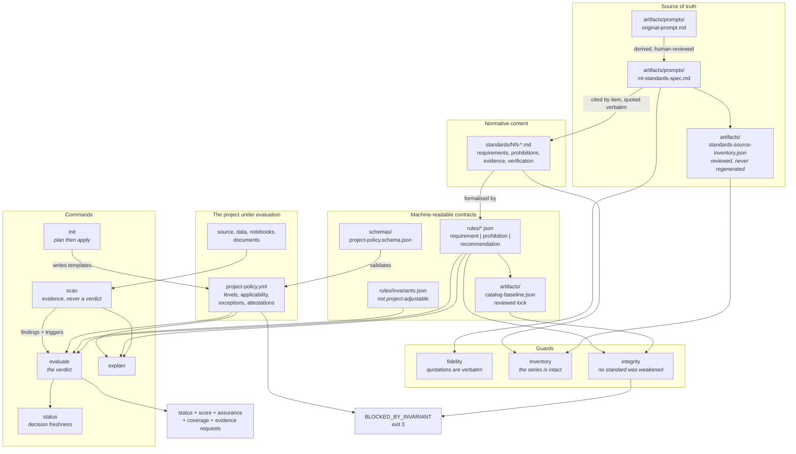

# Architecture

<!-- Generated by /codebase-docs and kept honest by `npm run diagrams`, which compares the
     embedded Mermaid block below against docs/architecture.mmd. Regenerate this document rather
     than hand-patching it: the .mmd file is canonical, and an embedded copy that no longer matches
     it is documentation that has quietly begun describing something else. -->

How the pieces fit, for a reader arriving cold. The reasoning behind the design is in
[design/architecture.md](../design/architecture.md); this document describes what exists.

## The shape of it

## The chain, in one sentence each

**The brief is the only input.** `artifacts/prompts/original-prompt.md` is preserved exactly as
received and never edited.

**The specification is derived from it, by a human, and says so.** Item titles are the brief's
topic bullets in order; the must-never and evaluation-philosophy sections are byte-identical and can
be checked with a plain diff.

**The inventory locks the enumeration.** It was reviewed once and committed, and `inventory`
compares extraction against it — so a change to the parser can disagree with the series but cannot
redefine it.

**The standards quote the specification, and `fidelity` holds them to it.** Any block a document
claims is verbatim must match character for character; a paraphrased prohibition no longer says what
its author wrote.

**The catalog formalises the standards without redefining them.** Each entry names the standard and
the heading it comes from, its kind, how it is verified, and — honestly — how much that verification
establishes.

**The baseline locks the catalog.** `integrity` reports any rule removed, downgraded,
reclassified, made exemptible, or made attestable since the baseline was reviewed. The catalog may
change; it may not change invisibly.

**The policy configures, and never redefines.** A project declares levels, applicability,
exceptions, and attestations. It may raise an obligation and not lower one, and it may not address
an invariant at all.

**The scan produces evidence and no verdict.** Three views of every source file keep naming a
library distinct from using one.

**The evaluation produces the verdict**, applying invariants first, then applicability,
attestations, the evaluated set, and finally the findings — and it has no path that reaches
`passed` without either an examination or a human judgement.

## Reading a report

`status`, `score`, and `frameworkCoverage` are three separate numbers and never combine. The
score is over the rules that were evaluated; coverage says how many can be evaluated at all. In this
domain coverage is low, because a cherry-picked evaluation period and a hidden segment leave no
trace in a repository — so a status quoted without coverage means "everything checked passed"
while reading as "everything was checked".

## Where to start

| Task | Start at |
| --- | --- |
| Understand why the model is shaped this way | [design/architecture.md](../design/architecture.md) |
| Adopt the standards in a project | [INSTRUCTIONS.md](../INSTRUCTIONS.md) |
| Add or change a rule | `rules/`, then `artifacts/catalog-baseline.json`, then `CHANGELOG.md` |
| Add a detector | [design/ml-audit-detectors.md](../design/ml-audit-detectors.md) first, then `scripts/standards.mjs` |
| Understand a conclusion | `standards explain <rule-id>` |

## Known gaps

Stated here because a document that hides them is doing the thing this repository exists to prevent.

- Most rules have no mechanism and rest on attestation.
- The leakage detectors read in-file ordering and naming conventions, and are Python-shaped.
- Document checks confirm that a document exists with the expected sections, never that its content
  is true.
- No rendered diagram is committed: rendering one needs a Mermaid toolchain, which would end the
  zero-dependency property. The `.mmd` file is canonical and the embedded copy above is checked
  against it.
